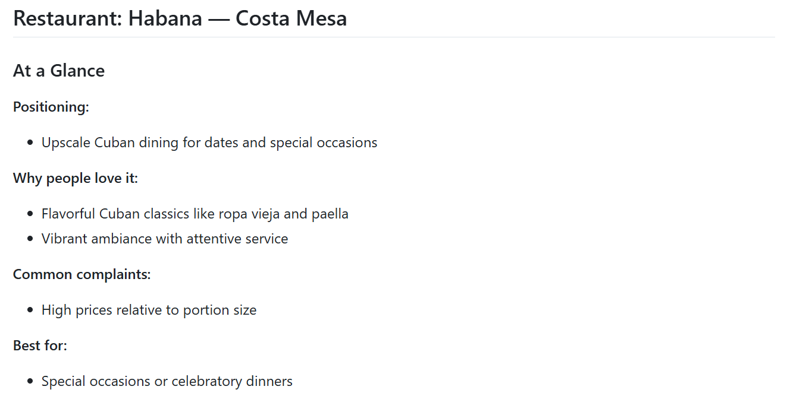
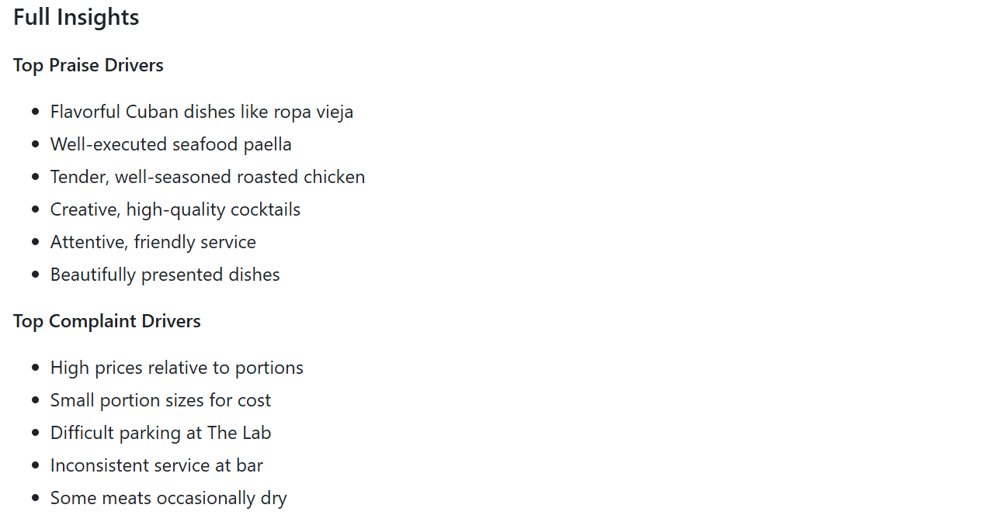

# TasteLens — AI Review Insight Engine

## Overview

TasteLens is a prompt-driven AI workflow that converts unstructured restaurant reviews into clear, structured insights. 

Instead of reading dozens of reviews, users receive a structured breakdown of:
- Core praise drivers  
- Recurring complaint themes  
- Vibe and experience signals  
- Occasion fit  
- Differentiators  
- Cross-business patterns

The goal is to reduce review overload and surface the patterns that actually define a business.

---

## The Problem

Online reviews are:
- Repetitive  
- Emotionally biased  
- Unstructured  
- Time-consuming to interpret  

Users must manually read through dozens of reviews to understand true strengths and weaknesses.
There is no built-in structure that separates signal from noise.

---

## The Solution

TasteLens uses a structured prompt design to:
1. Extract recurring praise, complaint, and experience themes from raw review text  
2. Organize themes into consistent insight categories  
3. Synthesize themes to clarify positioning signals and tradeoffs
4. Compare outputs to identify cross-business patterns
5. Present results in a skimmable, layered format

The result is a structured output that supports faster evaluation and comparison without reading every review.

---

## Pipeline Design

### Stage 1 — Structured Extraction  
AI prompts convert raw reviews into categorized insight buckets:
- Praise Drivers  
- Complaint Drivers  
- Vibe & Experience Signals  
- Occasion Fit  
- Differentiators

Structured extraction was implemented using OpenAI’s GPT-based LLM via prompt-driven iteration and constraint refinement.

### Stage 2 — Synthesis Layer  
Structured outputs are analyzed to identify recurring positioning signals, tradeoffs, and cross-business themes.

### Stage 3 — Presentation Layer  
Insights are compressed into “At a Glance” summaries layered above detailed breakdowns to simulate a user-facing product view.

This staged design reflects how structured prompt-driven AI workflows could be orchestrated in a production insight tool.

---

## Example Output

See: `outputs.md`

### 🖼️ At a Glance Snapshot (Prototype View)
<table>
<tr>
<td>

</td>
</tr>
</table>

### 🖼️ Full Insights Breakdown (Prototype View - Partial)
<table>
<tr>
<td>

</td>
</tr>
</table>

Each restaurant includes:
- **At a Glance snapshot**
- Full structured insight breakdown
- Concise insight summary
- Cross-restaurant system observations

---

## Key System-Level Observations

Across three restaurants analyzed:
- Premium pricing appears across concepts.  
- Customers accept higher prices when quality feels consistent.  
- Long lines are tolerated when service moves efficiently.  
- Signature items anchor brand identity.  
- Atmosphere shapes occasion fit and positioning.  
- Operational friction drives negative sentiment quickly.

These patterns demonstrate how structured extraction can reveal broader market signals beyond individual reviews.

---

## Repository Structure

- `README.md` — Project overview
- `extraction_prompt.txt` — AI extraction prompt
- `reviews_sample.txt` — Sample reviews dataset 
- `outputs.md` — Structured insight outputs

---

## Product Memo

See `product_memo.md` for full product rationale, data selection decisions, design tradeoffs, and future roadmap.

---

## Future Improvements

- Automate ingestion from review URLs  
- Add sentiment scoring per insight category  
- Introduce comparative scoring between businesses  
- Build lightweight UI for interactive filtering

**Exploratory Extensions**
- Overhyped Restaurant Detector (compare social media hype vs. review sentiment)
- AI Personal Restaurant Recommender (match users to restaurants based on preference signals)

These extensions build on the same structured insight foundation while expanding into comparative and personalization use cases.

---

TasteLens is designed as a prototype AI insight engine demonstrating structured prompt design, synthesis, and presentation layering — not just summarization.
